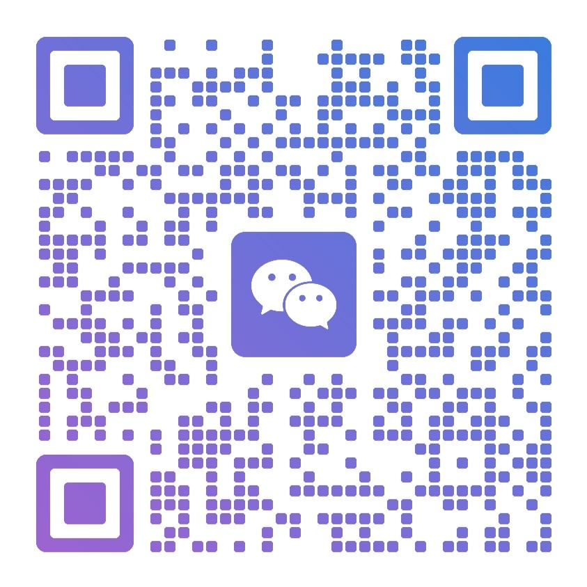

<!-- 
  
  通过主页链接访问。
-->

# 
> **版本**: 2026.06 | **有效期**: 长期有效  
> 返回主页：[🏠 回到个人简介](./README.md)

---

## ✅ 核心交流项目

### 1. ☁️ 云端监控机器人
**适用场景**：电商运营、舆情监控、库存预警。
- **功能描述**：
  - 部署在阿里云服务器，**7x24 小时不间断**运行。
  - 实时监控指定目标（价格、库存、新闻、公告）。
  - 异常变动 **秒级通知** (支持微信、邮件、钉钉)。
  - 数据自动记录到 Excel 或 数据库。

### 2. 🔄 数据自动搬运
**适用场景**：财务对账、运营报表、订单处理。
- **功能描述**：
  - 自动从 A 平台/文件 抓取数据，清洗后填入 B 平台/Excel。
  - 替代人工复制粘贴，准确率 100%。
  - 支持定时任务（如：每天上午 9 点自动发送昨日报表）。

### 3. 🏗️ 企业工作流自动化 (定制系统)
**适用场景**：复杂业务逻辑、多系统打通、私有化部署。
- **功能描述**：
  - 基于 **OpenClaw 架构** 深度定制。
  - 包含用户鉴权、数据入库、异常重试机制、可视化看板。
  - 支持 Docker 容器化交付，易于迁移。

---

## 🛡️ 维护与支持 (SLA)

所有交流项目均包含 **基础保修期**。

---

## 📞 立即合作

有需求？不确定能否实现？
欢迎联系我进行交流。

### 联系方式
- 📧 **Email**: [943511834@qq.com](mailto:943511834@qq.com) (推荐，24h 内回复)
- 💬 **WeChat**: `wxid_u9ckuk9av20a22` (搜索失败请扫码)

### 📱 微信二维码 (扫码直通)

  <!-- 🔍 记得把 wechat-qr.png 上传到仓库，或者用你的图片链接 -->
  
   
  扫码备注 "GitHub 合作" 优先通过

---

> ⚠️ **免责声明**：所有自动化服务均遵守目标平台 robots 协议及相关法律法规。不涉及任何黑灰产、爬虫攻击或数据窃取业务。
